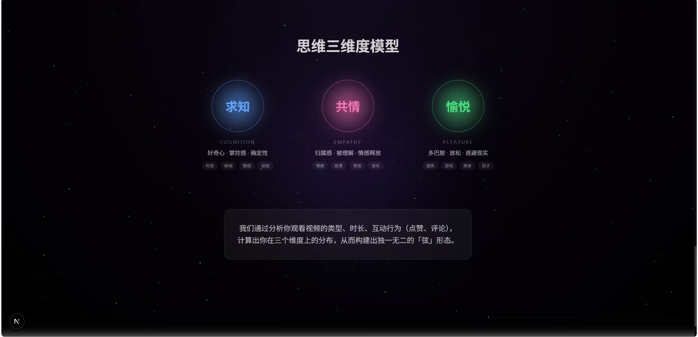
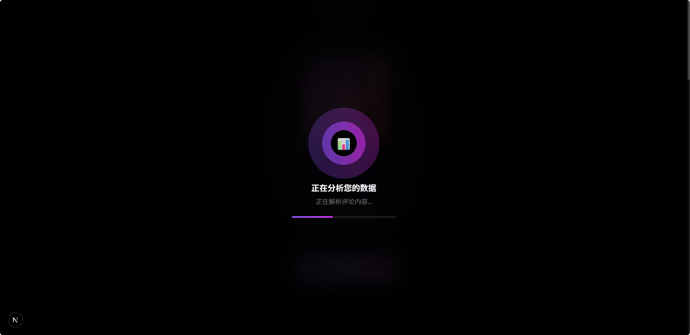
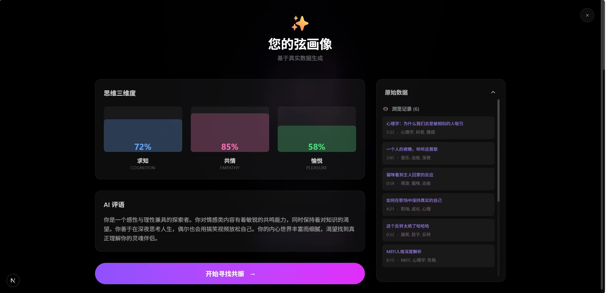
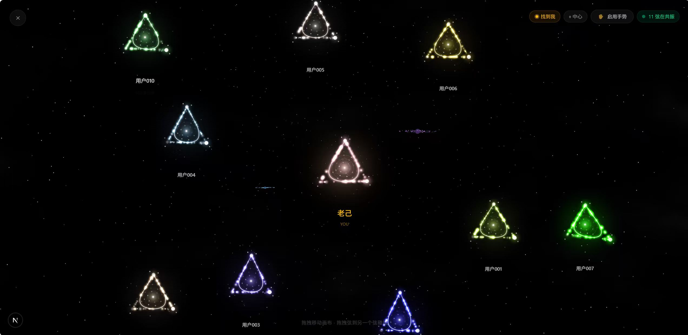
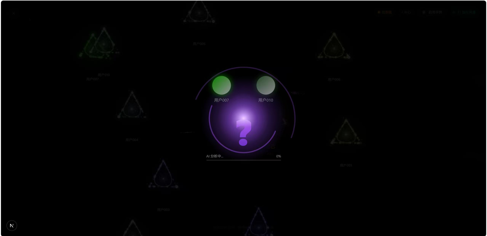
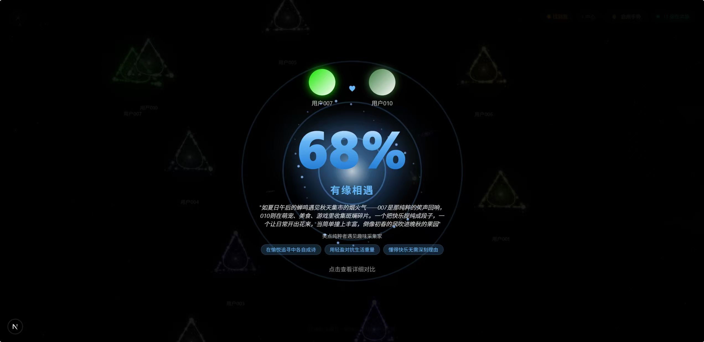

<div align="center">

# 闲 (Xián)

### 透过数据之弦，看见真实的你

[](https://nextjs.org/)
[](https://www.typescriptlang.org/)
[](https://tailwindcss.com/)
[](./LICENSE)

[演示](#演示) · [功能特性](#功能特性) · [快速开始](#快速开始) · [技术架构](#技术架构)

---


*基于真实社交媒体数据的轻社交应用*

</div>

## 什么是「闲」

> 灵感源自宇宙弦理论（String Theory）—— 弦是一切物质的基本构成单位

**闲** 是一个创新的轻社交应用，通过分析用户的抖音观看历史，将行为数据可视化为独特的三角形「弦」。每个人的「弦」都是独一无二的，反映了你思维的三个核心维度。

<div align="center">

</div>

| 维度 | 含义 | 驱动力 |
|:---:|:---|:---|
| **求知** | 我想理解这个世界 | 好奇心、掌控感、确定性 |
| **共情** | 我想与世界连接 | 归属感、被理解、情感释放 |
| **愉悦** | 我想此刻快乐 | 多巴胺、放松、逃避现实 |

## 工作原理

<div align="center">

</div>

1. **数据获取** - 基于抖音 API 获取用户真实的视频浏览、点赞、评论数据
2. **深度理解** - AI 深度解析每一个视频的内容含义，提取深层语义标签
3. **画像构建** - 基于海量语义标签，构建独一无二的「弦」形态画像
4. **灵魂匹配** - 计算用户画像之间的共振频率，找到与你同频的灵魂

## 演示

### 数据分析

<div align="center">

</div>

### 您的弦画像

<div align="center">

</div>

### 弦宇宙

<div align="center">

</div>

### 灵魂匹配

<div align="center">
<table>
<tr>
<td></td>
<td></td>
</tr>
</table>
</div>

### 详细对比

<div align="center">

</div>

## 功能特性

| 功能 | 描述 |
|:---|:---|
| **数据可视化** | 将抖音行为数据转化为独特的彩色三角形「弦」 |
| **弦宇宙** | 在宇宙中浏览其他用户的「弦」，拖拽探索 |
| **碰撞交互** | 拖拽你的「弦」与他人碰撞，发现彼此的异同 |
| **AI 分析** | 智能生成场景故事，预见你们相处的模样 |
| **维度对比** | 展示两个用户的三维度数据差异 |

### 视频分类权重

<details>
<summary>📊 点击查看完整分类权重表</summary>

| 视频类型 | 求知 | 共情 | 愉悦 |
|:---|:---:|:---:|:---:|
| 知识科普 | 0.9 | 0.1 | 0.0 |
| 新闻资讯 | 0.7 | 0.2 | 0.1 |
| 教程技能 | 0.8 | 0.1 | 0.1 |
| 情感故事 | 0.1 | 0.8 | 0.1 |
| 音乐MV | 0.1 | 0.6 | 0.3 |
| 宠物萌宠 | 0.0 | 0.5 | 0.5 |
| 搞笑段子 | 0.0 | 0.1 | 0.9 |
| 游戏直播 | 0.1 | 0.2 | 0.7 |
| 美食探店 | 0.2 | 0.2 | 0.6 |
| 励志鸡汤 | 0.3 | 0.5 | 0.2 |
| 社会议题 | 0.5 | 0.4 | 0.1 |

</details>

## 快速开始

### 环境要求

- **Node.js** 18.0+
- **npm** 9.0+ 或 **pnpm** 8.0+

### 安装运行

```bash
# 克隆项目
git clone https://github.com/TANGandXUE/xian.git
cd xian

# 安装依赖
npm install

# 启动开发服务器
npm run dev
```

打开浏览器访问 **http://localhost:3000**

## 技术架构

| 层级 | 技术 | 说明 |
|:---:|:---|:---|
| **框架** | Next.js 15 | React 全栈框架 |
| **语言** | TypeScript | 类型安全 |
| **样式** | Tailwind CSS | 原子化 CSS |
| **UI** | shadcn/ui | 基于 Radix UI |
| **3D** | Three.js | 弦可视化渲染 |
| **状态** | Zustand | 轻量级状态管理 |
| **AI** | Qwen API | 视频智能分类 |

## 许可证

[MIT License](./LICENSE)

---

<div align="center">

*期待找到与你灵魂共振的人*

</div>
